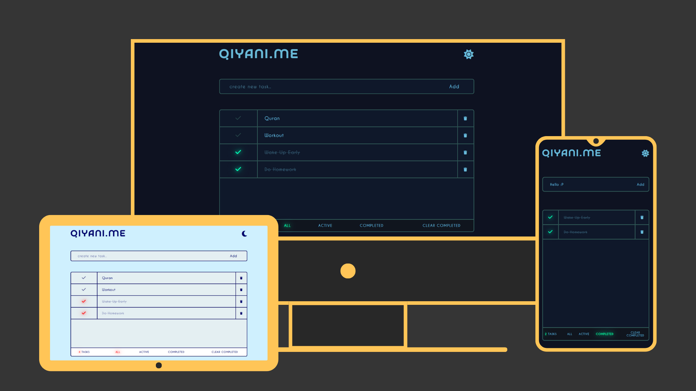

# ✅ To-Do List App

A beautifully designed to-do list app built with HTML, CSS, and JavaScript. Manage your tasks easily with dark/light mode, filtering options, and automatic saving.

## 🌟 Features

- 🎨 Modern and responsive UI with dark & light modes  
- ➕ Add tasks quickly by pressing **Enter** or clicking the Add button  
- 🎯 Input auto-focus for faster task entry  
- 📂 Local storage support (tasks remain saved even after refreshing)  
- 🔍 Filter tasks:  
  - Show all  
  - Show only completed  
  - Show only uncompleted  
- 🗑️ One-click remove all completed tasks  

## 🧰 Tech Stack

- HTML  
- CSS  
- Vanilla JavaScript  

## 🚀 Live Demo

Try it here👇  
https://zeddy-foreal.github.io/to-do-list

## 📸 Preview



## 📁 How to Run Locally

```bash
git clone https://github.com/zeddy-foreal/to-do-list.git
cd to-do-list
# Then open index.html in your browser

